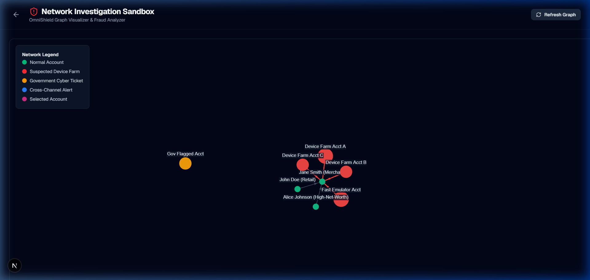
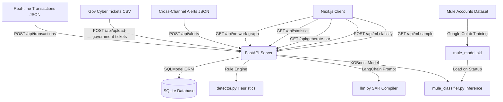

# OmniShield 🛡️

**OmniShield** is a Full-Stack Fraud Fingerprinting & Network Sandbox platform built for a banking hackathon. It ingests multi-channel transaction feeds, evaluates device parameters for velocity and emulator anomalies, maps cash routing graphs, and generates AI-driven compliance reports (SAR) for investigators.



---

## 🏗️ Architecture & Flow



---

## 🚀 Key Features

### 1. Multi-Feed Data Ingestion
* **Real-time Transactions**: Receives telemetry data (IP, fingerprint, login timestamps) alongside transaction payloads.
* **Government CSV Tickets**: Upload static list of cyber complaints from state authorities, automatically matching and linking to user nodes.
* **Cross-Channel Security Alerts**: Tracks contextual exceptions (e.g. failed password counts, geo-location hops).

### 2. Heuristic Behavioral Fingerprinting (`detector.py`)
* **IP Velocity Check**: Detects if multiple unique account IDs execute money transfers from the exact same IP address or hardware fingerprint within a 5-minute window.
* **Retroactive Flagging**: When a velocity check triggers, the system retroactively updates previous clean transactions within the 5-minute window to flag the entire chain.
* **Emulator Bot Check**: Analyzes "Time-to-Transfer" (latency between login and execution). Latencies under `2.0 seconds` trigger automated emulator flags.

### 3. Interactive Network Sandbox
* **Visual Graph**: An interactive canvas-based 2D force-directed node graph representing accounts (nodes) and cash flows (links).
* **Dynamic Node Coloring**:
  - **Teal**: Normal active accounts.
  - **Red**: Suspected Device Farm accounts.
  - **Orange**: Government cyber ticket matches.
  - **Blue**: Cross-Channel alerts.
  - **Pink**: Current selection under investigation.
* **Quick Select**: Dropdown target lock-on to select nodes instantly and bypass canvas click boundaries.

### 4. AI-Driven Compliance Compiler (SAR)
* Queries database context (linked alerts, velocity details, money flows) and compiles a professional 3-paragraph **Suspicious Activity Report (SAR)** following FinCEN compliance guidelines.
* Supported by **LangChain** utilizing OpenAI/Gemini APIs, with a high-fidelity template-based generator fallback for offline use.

### 5. Explainable AI (XAI) Mule Classifier (Problem Statement 2)
* **High-Accuracy Classification**: Trains an XGBoost Classifier on 3,924 anonymized features to predict suspicious money mule activities (under target label `F3924`).
* **Categorical & Missing Value Handling**: Natively handles missing values (NaNs) and automatically handles category columns (e.g. Account Type, Occupation, Gender) during training and real-time prediction.
* **Explainable AI (XAI) Dashboard**: Deconstructs the "black box" prediction, highlighting the top 10 most influential features contributing to a specific account's risk score using visual feature importance charts.
* **Dynamic Testing Sample**: Instantly pulls random, real rows from the dataset via the `/api/ml-sample` endpoint to test prediction workflows on the fly.

---

## 🛠️ Tech Stack

* **Frontend**: Next.js 15 (App Router), TypeScript, Tailwind CSS, `react-force-graph-2d`, Lucide React, Recharts (for XAI visualization)
* **Backend**: FastAPI (Python), SQLModel, **XGBoost, scikit-learn, joblib** (ML Pipeline)
* **Database**: SQLite (local fallback) / PostgreSQL compatible
* **AI/LLM**: LangChain, python-dotenv

---

## 💻 Getting Started (Local Run)

### Prerequisites
* Python 3.10+
* Node.js v18+ & npm

### 1. Set Up Backend (FastAPI)
1. Navigate to the backend directory:
   ```bash
   cd backend
   ```
2. Initialize virtual environment and activate:
   * **Windows (PowerShell)**:
     ```powershell
     python -m venv venv
     .\venv\Scripts\Activate.ps1
     ```
   * **macOS/Linux**:
     ```bash
     python -m venv venv
     source venv/bin/activate
     ```
3. Install dependencies:
   ```bash
   pip install -r requirements.txt
   ```
4. Start the API server:
   ```bash
   uvicorn app.main:app --port 8000 --reload
   ```
   *The Swagger interactive docs will be available at `http://localhost:8000/docs`.*

### 2. Set Up Frontend (Next.js)
1. Navigate to the frontend directory:
   ```bash
   cd ../frontend
   ```
2. Install npm packages:
   ```bash
   npm install
   ```
3. Run the Next.js development server:
   ```bash
   npm run dev
   ```
4. Open **`http://localhost:3000`** in your browser.

---

## 🧠 ML Model Training & Setup

Since the dataset is 116MB and contains thousands of features, we train the full XGBoost model on **Google Colab** and deploy the resulting binary locally.

### 1. Training the Model on Google Colab
1. Create a new notebook on Google Colab.
2. Clone the repository inside your notebook:
   ```python
   !git clone https://github.com/Garv767/OmniShield.git
   %cd OmniShield
   ```
3. Upload `DataSet.csv` into the `OmniShield` directory in Colab (or copy it from Google Drive).
4. Run the training script:
   ```python
   !python backend/train_model.py --data DataSet.csv --output backend/app/mule_model.pkl
   ```
5. Download the generated `mule_model.pkl` file from the Colab file manager (`OmniShield/backend/app/mule_model.pkl`).
6. Place the file in your local directory at `backend/app/mule_model.pkl`.

### 2. Rerunning locally
* The FastAPI backend automatically loads `backend/app/mule_model.pkl` on startup. 
* Run your uvicorn command, and it will confirm: `Successfully loaded ML model from app/mule_model.pkl`.

---

## 🧪 Simulation & Testing

To seed the database with a pre-configured multi-channel scenario (velocity flags, emulator triggers, government tickets, and alerts):

1. Run the backend test suite:
   ```bash
   cd backend
   .\venv\Scripts\python.exe test_endpoints.py
   ```
2. Alternatively, click the **"Seed Demo Data"** button in the header of the frontend landing dashboard (`http://localhost:3000`).
3. Navigate to the **ML Analysis** tab in the sidebar to test the Explainable AI (XAI) predictions by loading random samples from the dataset.
